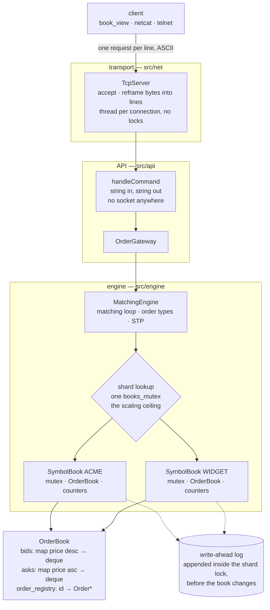

# Order Matching Engine (C++17)

[](https://github.com/Sunil-Chekuri/order-matching-engine/actions/workflows/ci.yml)

A limit order book with price-time priority matching, written in C++17. Four order types
across multiple symbols, a write-ahead log it can replay, a plain-text TCP protocol, and a
terminal client that shows live depth.

Built over three weeks with one rule: no claim in this README without a measurement behind
it.

## Numbers

Measured on 4 cores at 1190 MHz, Windows 11, GCC 16.1.0 (MinGW-w64), CMake `Release`. This
machine has ~2x run-to-run variance, so everything is a percentile or a multi-repetition
aggregate. I don't quote `max` anywhere; on this hardware it measures the OS scheduler.

| | Measured |
|---|---|
| Submit latency, in process | p50 **500 ns**, p99 **1000 ns** |
| Throughput, one thread | **3.05 M orders/sec** |
| Throughput, four threads | **1.14 M orders/sec** |
| One matching pair (submit + match + remove, both sides) | **547 ns** |
| Depth snapshot, 5 levels | **~74 ns**, flat regardless of book size |
| TCP round trip, loopback | p50 **~23 µs** |
| Write-ahead log, flush per record | **~28x** throughput cost |
| Tests | **218 passing** |
| Line coverage | **91.8%** (1,115 of 1,215 lines) |

Note the four-thread number is worse than the one-thread number. Throughput drops as I add
threads, and [Concurrency](#concurrency) explains why.

## What it does

- Price-time priority: best price first, FIFO within a price level.
- Four order types. `LIMIT` rests. `MARKET` sweeps the other side ignoring price. `IOC`
  sweeps at its limit and discards the remainder. `FOK` checks it can fill completely before
  trading anything, so it's all-or-nothing rather than a rollback.
- Self-trade prevention: orders sharing a nonzero `participant_id` never trade with each
  other.
- Per-symbol sharding: each symbol gets its own book, mutex and counters.
- Write-ahead log with replay. I log commands, not results.
- L2 depth snapshots, aggregated one row per price level.
- Line-based TCP protocol, drivable from telnet.
- `book_view`, a read-only terminal client that repaints the ladder as the book moves.

## Architecture



Splitting `protocol` from `transport` is what makes the network layer testable.
`handleCommand` takes a string and returns a string, so 29 of the 40 tests I wrote for it
never open a socket.

## Concurrency

Each symbol has its own lock. One extra mutex guards the lookup that finds the shard, and
that lookup is the bottleneck.

The lock sits in `MatchingEngine`, not `OrderBook`. `bestBid()` and `bestAsk()` return
references into deques the matching loop then mutates across several calls, so a per-method
mutex inside the book would release the lock while a caller still held a live reference.
That turns a dangling-pointer bug I'd already fixed into a race instead.

Sharding shortened the global critical section from a whole match down to a hash lookup,
worth about 2x at two threads, but every order still takes that one mutex. So throughput
falls as threads are added.

The obvious fix is a reader-writer lock, since shard lookups are nearly all reads. I wrote
it and it's broken: it intermittently builds two shards for one symbol, loses orders, and
in roughly 1 in 80 runs dies with an access violation from a corrupted map. Five standalone
probes of `std::shared_mutex` came back clean, so I still don't know why. The shipped build
uses a plain `std::mutex` and survives 2,000 runs with zero failures. A faster lock that's
wrong isn't a trade I'm willing to make.

The server takes no locks of its own. Thread per connection, sharing one gateway, which is
only safe because of the sharding above and stops working somewhere in the low thousands of
connections.

## Design decisions

**`std::map` for price levels, not a hash map.** Every match needs the best price, which
means ordered iteration. The cost shows up in the numbers: the per-level walk degrades from
3.84 ns at depth 10 to 7.59 ns at depth 1000 as it outgrows cache.

**The WAL logs commands, not results.** Matching is deterministic for a given input
sequence, so replaying submits and cancels regenerates every trade. Half the write volume,
and no way to end up with a log whose trades disagree with its orders.

**It flushes every record, at 28x cost.** Dropping the flush is 4.6x faster and gives up the
point, since the records you need after a crash are the ones still in the buffer. Flushing
only reaches the OS though; surviving power loss needs `fsync`, which I don't do.

**Text protocol, not binary.** The parse is ~4 µs against ~23 µs of round trip. Being able
to drive it from telnet is worth more than those microseconds.

**Per-shard counters, not shared atomics.** One atomic touched by every order would put a
contended cache line back on the hot path.

More in [docs/design-notes.md](docs/design-notes.md).

## Benchmarks

Google Benchmark rows are 5-repetition aggregates; `cv` is the coefficient of variation
across repetitions.

| Operation | Mean | cv |
|---|---|---|
| Matching pair | 547 ns | 4.4% |
| Resting insert, no match | 161 ns | 23.4% |
| Submit then cancel | 444 ns | 11.5% |
| `availableToMatch`, depth 1 | 5.83 ns | 5.9% |
| `availableToMatch`, depth 10 | 38.4 ns | 3.9% |
| `availableToMatch`, depth 100 | 515 ns | 12.0% |
| `availableToMatch`, depth 1000 | 7590 ns | 6.8% |

**Depth snapshots.** `snapshot(5)` against books of 10 / 100 / 1000 price levels: 82.4 /
82.3 / 72.0 ns, i.e. flat, against `availableToMatch`'s 38.4 / 515 / 7590 ns on the same
books. Sweeping requested depth on a 1000-level book: 63.7 / 73.4 / 302 / 3882 ns at depths
1 / 5 / 50 / 500. Aggregation sums every order in a level, so `snapshot(1)` costs 80.2 /
144 / 8613 ns when that level holds 1 / 100 / 10,000 orders.

**Thread scaling**, both columns from the same session:

| Threads | All threads on one symbol | One symbol per thread |
|---|---|---|
| 1 | 2.94 M orders/s | 3.05 M orders/s |
| 2 | 0.90 M orders/s | **1.72 M orders/s** |
| 4 | 1.00 M orders/s | 1.14 M orders/s |

Before sharding existed, with one global lock: 3.54 / 1.48 / 1.68 M orders/s at 1 / 2 / 4
threads. At four threads each iteration burned 1192 ns of CPU against 3376 ns of wall clock,
so threads were blocked about two-thirds of the time.

**Cost of durability**, per matching pair:

| Configuration | Per pair | vs no WAL |
|---|---|---|
| No WAL | 800 ns | 1x |
| Buffered, no flush | 4,930 ns | ~6x |
| Flush per record (shipped) | **22,663 ns** | **~28x** |
| Flush per record, log inside the OneDrive-synced repo | 101,471 ns | ~127x |

That last row is a warning, not a WAL measurement. This repo lives in a synced folder and
the sync client once inflated a result 4.5x by touching files mid-benchmark.

**Across the network.** Loopback, one connection, 20,000 round trips, p50 over four runs:
`PING` 22,700 / 23,500 / 22,900 / 33,900 ns, `SUBMIT` 27,000 / 34,200 / 26,600 / 37,800 ns.
So ~23 µs of round trip against ~4 µs for the parse and the match together, and one
connection tops out near 37,000 orders/sec against 2.94 M/s in process. Past the socket the
engine isn't the bottleneck.

Removing a log call from inside the matching loop moved the mean from ~424 ns to ~361 ns.

## Tests and tooling

218 tests under GoogleTest, covering the matching loop, all four order types, self-trade
prevention, partial-fill bookkeeping, concurrency invariants, multi-symbol isolation, WAL
append and replay including truncated records, the protocol end to end without sockets,
transport framing and shutdown, and the viewer's parsing and rendering.

Line coverage is 91.8%. `matching_engine` and `order_book`, the two files that have to be
right, are both at 96.8%; the lowest is the logger at 73.2%.

There's a separate concurrency stress harness, and I measured whether it detects anything
before trusting it. Pointed at a defect I already knew about it catches it 45 times in 500
runs; against the shipped build it reports 0 failures in 5,000 fresh processes.

Builds are clean under `-Wall -Wextra -Werror`, applied per target so fetched dependencies
aren't held to it. Turning warnings on found one real bug, and it was undefined behaviour.

CI builds and tests on Linux GCC, Linux Clang and Windows MinGW, then runs ASan+UBSan, TSan,
clang-tidy and coverage. Its first run found two genuine bugs: a Clang-only `-Werror` failure
at three sites, and a Linux-only shutdown hang where the accept loop blocked in `accept()`
and closing the listening socket didn't wake it, which works on Winsock and doesn't on Linux.
Both fixed. The sanitizers haven't completed a run yet, so the concurrency work still hasn't
been checked by a tool built for the job.

## Building and running

C++17 compiler, CMake 3.14+, Ninja. Developed on GCC 16.1.0 (MinGW-w64) on Windows, so the
commands are PowerShell; on Linux they're the same without the `.exe`. GoogleTest and Google
Benchmark are fetched at configure time.

```powershell
cmake -S . -B build -G Ninja
cmake --build build
```

`Release` is the default build type deliberately. CMake's own default is empty, meaning no
optimisation flags, and I didn't notice for eight days. Every number before that understated
throughput by 2.2x.

```powershell
ctest --test-dir build --output-on-failure      # 218 tests

.\build\engine.exe                             # throughput + latency passes
.\build\engine.exe --serve 9001                # TCP server, binds 127.0.0.1 only

# book_view [host] [port] [symbol] [depth] [interval_ms]
.\build\cli\book_view.exe 127.0.0.1 9001 ACME 10 500

# Concurrency invariants: <rounds> <threads>. Non-zero exit on violation.
.\build\stress\engine_stress.exe 300 4

# Microbenchmarks. Always pass repetitions; one run is too noisy to conclude from.
.\build\benchmarks\engine_bench.exe --benchmark_min_time=0.5s `
    --benchmark_repetitions=5 --benchmark_report_aggregates_only=true
```

Add `-DENGINE_WERROR=ON` to compile what CI compiles.

## The protocol

One request per line, one reply per request, every reply starting `OK` or `ERR <reason>`.
Reasons are fixed lowercase tokens so a client can branch on them without parsing English.

```
PING
SUBMIT <id> <BUY|SELL> <LIMIT|MARKET|IOC|FOK> <price> <qty> [symbol] [participant]
CANCEL <id> [symbol]
QTY <id> [symbol]
SNAPSHOT <depth> [symbol]
METRICS
QUIT
```

A real session, `>` marking what I sent:

```
> PING
  OK pong
> SUBMIT 1 BUY LIMIT 100.50 10 ACME 7
  OK submitted 1 resting 10
> SUBMIT 2 SELL LIMIT 100.50 4 ACME 9
  OK submitted 2 resting 0
> QTY 1 ACME
  OK qty 6
> SNAPSHOT 2 ACME
  OK {"bids":[{"price":100.5,"quantity":6,"orders":1}],"asks":[]}
> METRICS
  OK {"orders_submitted":2,"trades_executed":1,"cancels_accepted":0,"cancels_rejected":0,"resting_orders":1,"symbols":1}
> CANCEL 1 ACME
  OK cancelled 1
> CANCEL 1 ACME
  ERR not_found
> SUBMIT 3 BUY FOK 99 5 ACME
  OK submitted 3 resting 0
> QUIT
  OK bye
```

Order 2 filled completely against order 1; order 1 kept 6 of its 10. The `FOK` at 99
couldn't fill against an empty book, so it did nothing at all.

## What's wrong with it

- **An open correctness bug.** The `shared_mutex` shard lookup corrupts the symbol map and I
  don't know why after five investigations. Shipping the plain-mutex version is a mitigation,
  not an explanation.
- **The lookup mutex caps throughput**, so adding threads makes it worse. Blocked on the bug
  above.
- **Self-trade prevention stops at the first self-order** instead of skipping past it, so a
  self-crossed pair at the top of book can block someone else's order until it's cancelled.
  Fixing it properly needs a different per-level structure.
- **WAL durability stops at the OS.** No `fsync`, so power loss can lose recent records.
- **The WAL is one file behind one mutex**, so every symbol serialises on it.
- **No auth, TLS, rate limiting or connection cap.** It binds `127.0.0.1` only, which limits
  exposure but isn't a security control.
- **Connections block with no read timeout**, so an idle client holds a thread forever.
- **Plain TCP, not WebSocket**, so a browser can't connect directly.
- **The depth viewer polls rather than subscribing**, so it shows states and never
  transitions, and anything between polls is invisible.
- **No request ids or pipelining.** Replies match requests by order alone.
- **Trades aren't persisted.** Replay regenerates them, but there's no history to query.
- **Snapshot aggregation is O(orders per level).** The cached-total fix needs the matching
  loop changed first, because partial fills are applied through a reference.
- **`config/config.json` exists and nothing reads it.**

## Author

Sunil Kumar
B.Tech Information Technology, NITK
Associate Developer, TransUnion

## License

MIT
